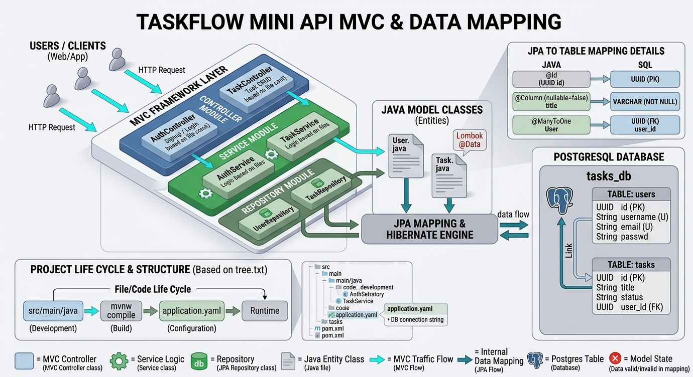

# TaskFlow Mini API 🚀



A lightweight REST API for Task Management built with Spring Boot, JPA, and PostgreSQL. Designed with clean architecture and industry-standard best practices.

## 🌟 Features

* **User Management**: Secure Sign-up and Sign-in functionality.
* **Task Management**: Create, view, and organize tasks assigned to specific users.
* **Modern Security**: Uses **UUIDs** instead of incremental IDs for enhanced security and scalability.
* **Data Integrity**: Handled via JPA/Hibernate with proper relationship mapping.
* **Interactive Documentation**: Fully integrated with **Swagger (OpenAPI)** for real-time testing.

## 🛠 Tech Stack

* **Language**: Java 17
* **Framework**: Spring Boot 3.x
* **Persistence**: Spring Data JPA / Hibernate
* **Database**: PostgreSQL
* **Tooling**: Lombok, Maven

## 🚀 How to Run

### 1. Database Setup

Create a PostgreSQL database named `tasks_db`:

```sql
CREATE DATABASE tasks_db;

```

### 2. Configuration

Update your database credentials in:
`src/main/resources/application.yaml`

```yaml
spring:
  datasource:
    url: jdbc:postgresql://localhost:5432/tasks_db
    username: your_username
    password: your_password

```

### 3. Execution

Navigate to the root directory and run:

```bash
./mvnw spring-boot:run

```

## 📖 API Documentation (Swagger)

The API documentation is automatically generated. Once the server is running, explore the endpoints here:
👉 [http://localhost:8080/swagger-ui/index.html](https://www.google.com/search?q=http://localhost:8080/swagger-ui/index.html)

---
